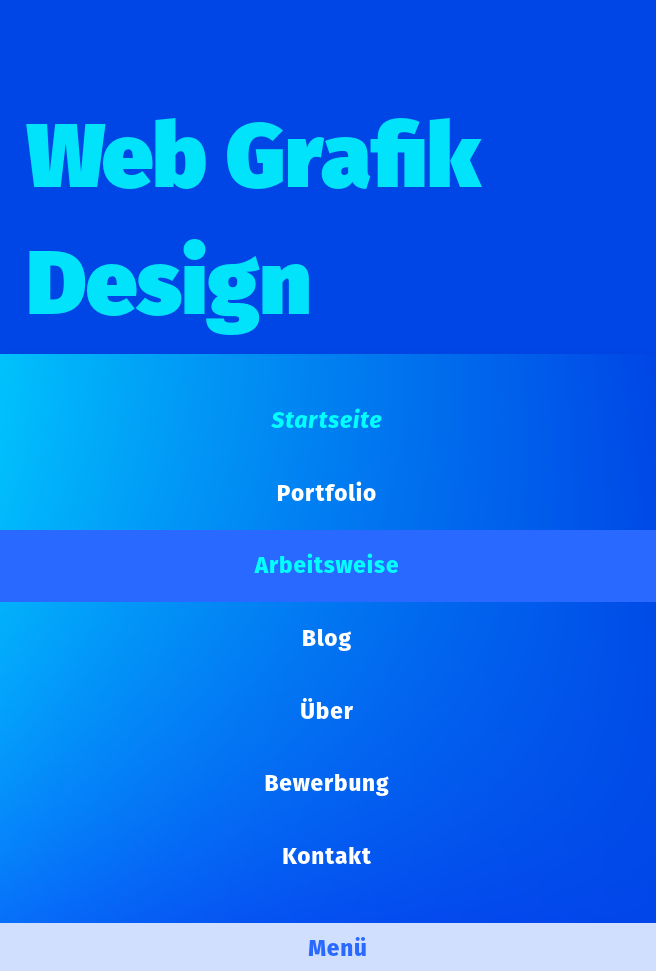
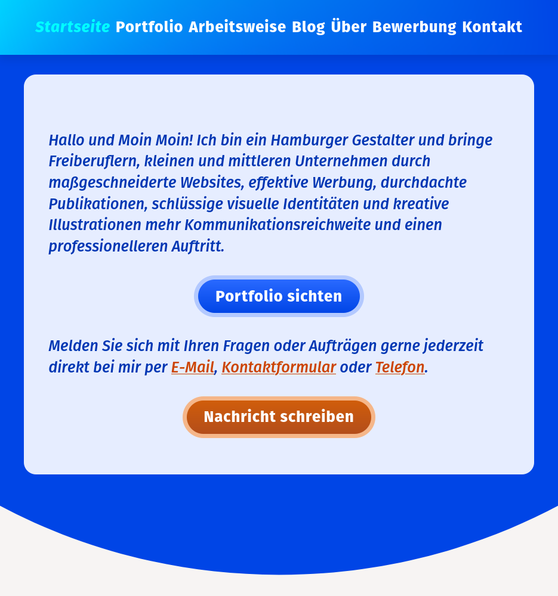
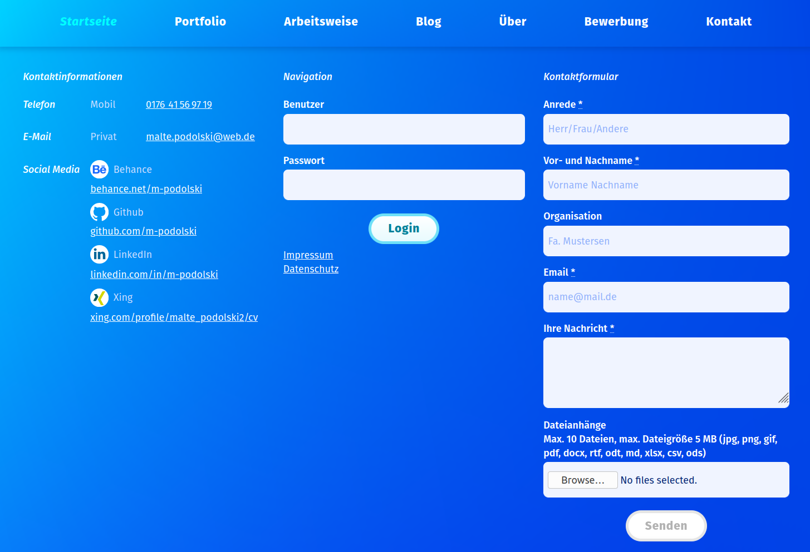
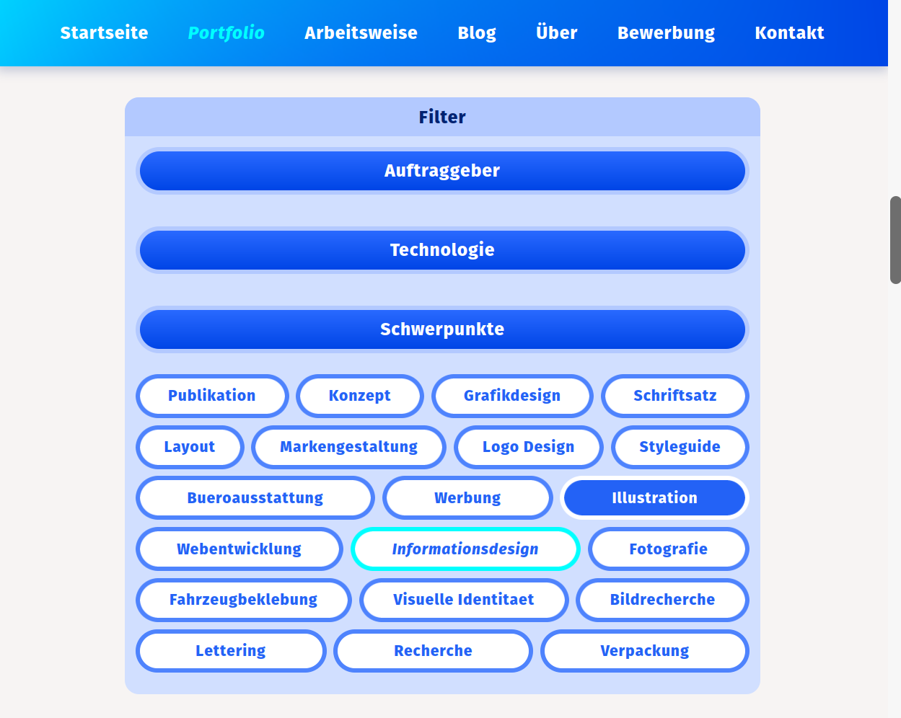
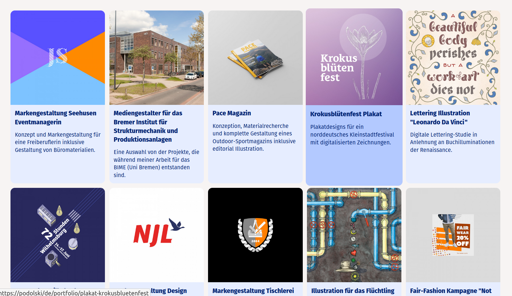
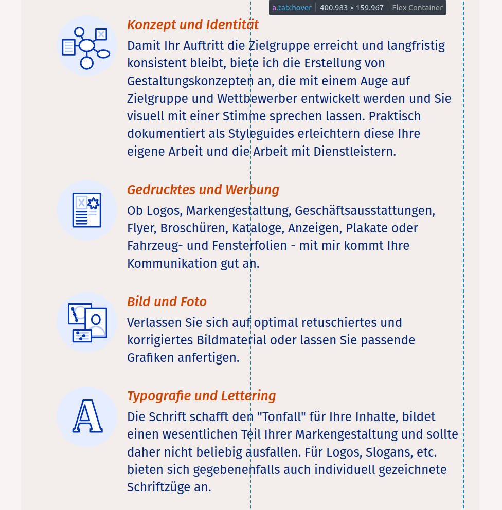
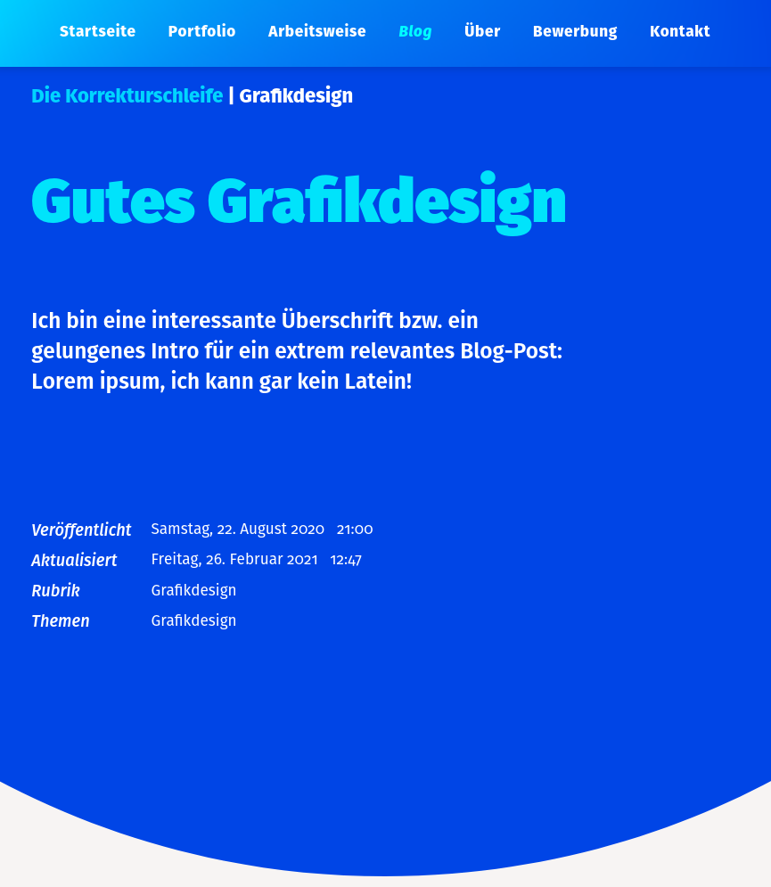

# podolski.de - My Personal Website

## Scope
This repo contains the current version of my personal/professional website. Its purpose is to mainly serve as a showcase for my **portfolio** of web development and graphic design projects but will also be a platform for a professionally-oriented **blog** which will discuss topics aimed at potential clients or employers.

It was also planned as a practical way to get into programming in **PHP and Javascript** while working with a CMS that would also be a viable solution for first client projects.

## Design
One of my goals was to come up with a design that feels unique while remaining highly usable both in respect to UI/UX and the general look and feel. The process started  with **research** and handmade **wireframes**, went on with **static high-res mockups** created in Adobe Illustrator which then also served as the source for assets like colour palettes, SVGs, images, icons, etc.

In doing so I kept to a **component-based approach** from the start which allows for rapid creation of new page templates and helps to avoid unneccessary redundancy already in the design phase.

## Tech
My first choice was PHP in conjunction with Bastian Allgeiers CMS **Kirby** ([getkirby.com](https://getkirby.com)) to explore a quick and flexible "batteries-included" solution for **small content-based client projects** that don't have complex requirements and therefore be able to avoid the complexity and pitfalls of Wordpress.

At the same time this allowed me to get the basics of web programming in PHP and JS down which proved to be a great way to learn effectively. Beyond **learning the basic language features** the focus was of course the frontend and **UI-related problems** such as accessibility and usability.

While Kirby uses file-based routing with a partly predefined (page-based) architecture, my component-based design was implementable as well without having to resolve to hacking and played together nicely with **SASS- and ES-Modules**. The build process was supported mainly by **Gulp** with a little help from **Webpack** for ESM-compression.

Currently i work on getting deeper into the weeds of the Javascript ecosystem and work on an new version of this website based on **Vue**. Because of this and my current participation at the **[Digital Carreer Institute](https://digitalcarreerinstitute.org)** this project will remain unfinished for a while.

## Impressions

### Navigation and CTA-Buttons

### Footer with Login and Contact Form

### Javascript Taxonomy-Filter

### Portfolio: Responsive Card Layout

### Typography and SVG-Icons

### Blog with Taxonomy Info

### Illustration "Discover"

